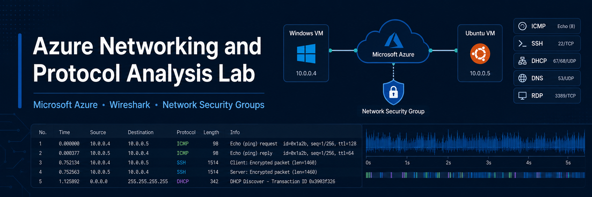
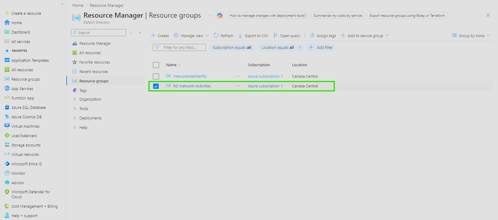
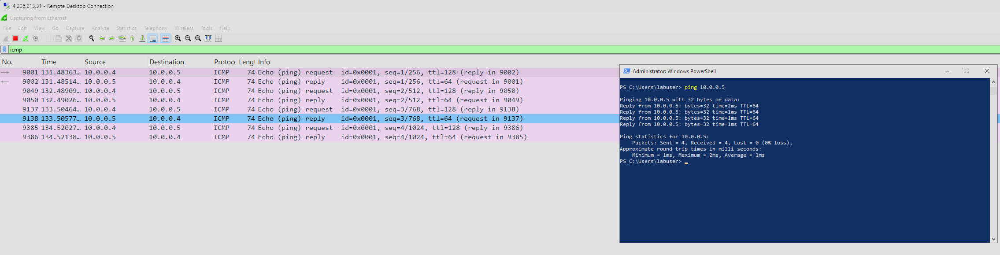
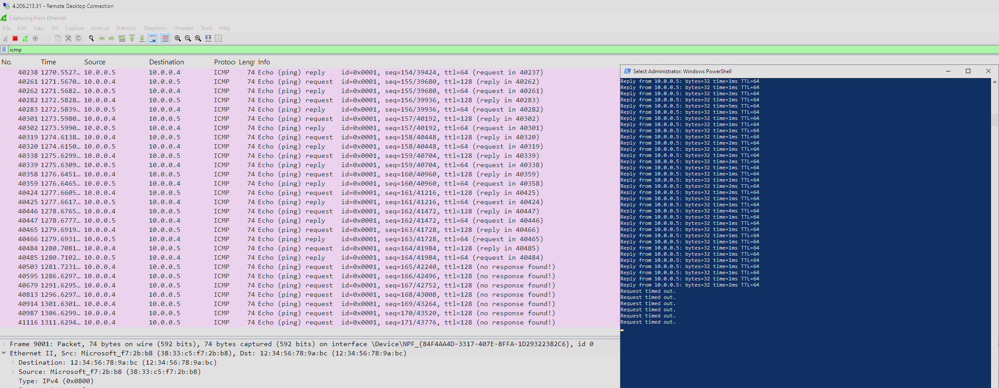

  

## Project Summary
This project demonstrates the deployment of Windows and Linux virtual machines in Microsoft Azure and the analysis of network traffic between them using Wireshark. The goal was to build a small cloud-based networking lab, observe common protocols in action, and test how Azure Network Security Groups affect connectivity. The lab included ICMP, SSH, DHCP, DNS, and RDP traffic analysis.

## Technologies Used
- Microsoft Azure
- Azure Virtual Machines
- Azure Virtual Network
- Network Security Groups (NSGs)
- Wireshark
- Remote Desktop
- PowerShell
- SSH

## Environments Used
- Windows 10 Virtual Machine
- Ubuntu Linux Virtual Machine
- Microsoft Azure

## Project Objectives
- Create a resource group in Azure
- Deploy Windows and Linux virtual machines
- Place both VMs in the same virtual network and subnet
- Observe ICMP traffic using Wireshark
- Use an NSG to block and re-enable inbound ICMP traffic
- Observe SSH, DHCP, DNS, and RDP traffic
- Practice packet analysis and cloud networking fundamentals

## Implementation Steps

### Step 1: Create the Azure Resource Group
Created a resource group in Microsoft Azure to contain all resources used in the lab.

  

### Step 2: Deploy the Windows 10 and Ubuntu Virtual Machines
Created a Windows 10 VM and an Ubuntu VM in the same resource group and virtual network.

### Step 3: Verify Both VMs Are on the Same Virtual Network
Confirmed both virtual machines were attached to the same VNet and subnet.

### Step 4: Observe ICMP Traffic
Connected to the Windows VM using Remote Desktop, installed Wireshark, filtered for ICMP traffic, and pinged the Ubuntu VM using its private IP address.

### Step 5: Test NSG Firewall Behavior
Started a continuous ping from the Windows VM to the Ubuntu VM, then blocked inbound ICMP traffic in the Ubuntu VM’s Network Security Group and observed the impact in both the command line and Wireshark. Re-enabled ICMP traffic and confirmed connectivity resumed.

### Step 6: Observe SSH Traffic
Filtered Wireshark for SSH traffic and used PowerShell on the Windows VM to SSH into the Ubuntu VM using its private IP address.

### Step 7: Observe DHCP Traffic
Ran `ipconfig /renew` in PowerShell as administrator on the Windows VM and observed DHCP-related traffic in Wireshark.

### Step 8: Observe DNS Traffic
Used `nslookup` to query public domains and observed DNS traffic in Wireshark.

### Step 9: Observe RDP Traffic
Filtered Wireshark for `tcp.port == 3389` and observed the continuous RDP traffic generated by the remote desktop session.

### Step 10: Lab Cleanup
Closed the Remote Desktop session, deleted the Azure resource group, and verified resource deletion.

## Demonstration / Results
This project successfully demonstrated:
- Windows and Linux VM communication within the same Azure virtual network
- ICMP request and reply traffic in Wireshark
- Network Security Group filtering behavior
- SSH traffic between the Windows and Ubuntu virtual machines
- DHCP traffic during IP renewal
- DNS traffic during name resolution
- Continuous RDP traffic over TCP port 3389

## Skills Demonstrated
- Microsoft Azure
- Virtual Machine Deployment
- Azure Virtual Networking
- Network Security Groups
- Wireshark Packet Analysis
- ICMP, SSH, DHCP, DNS, and RDP Protocol Analysis
- Troubleshooting
- Network Fundamentals

## Key Takeaways
This lab improved my understanding of how Azure virtual networking works and how common protocols appear in real packet captures. It also reinforced how firewall rules and NSGs affect connectivity and helped connect classroom networking concepts to hands-on practice.
